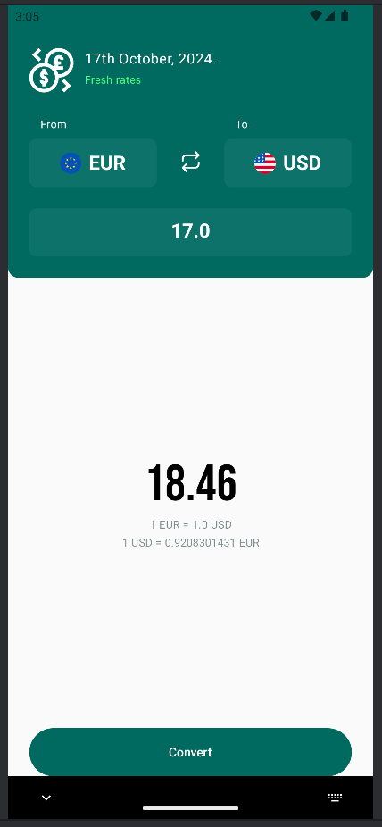

# Description 🏗️

Ce projet a été réalisé dans l'optique de découvrir et appréhender le
multiplateforme avec le langage Kotlin et le Compose Multiplatform.  
À cet effet, l'application qui en résulte est un calculateur de taux de change
entre différentes devises fournies par `https://currencyapi.com/`

# Concepts étudiés 📚

 - Mise en place d'une **MVVM** pour une application cross-platform (Android, iOS)
 à l'aide du framework **KMP**
 - Stockage en local à l'aide de **Realm**
 - Requêtes HTTP avec le client **Ktor**
 - Injection de dépendance avec **Koin**
 - Stockage des préférences utilisateur avec **multiplatform-settings**
 - Manipulation des dates en KMP avec **kotlinx-datetime**
 - Introduction à la navigation dans KMP avec la librairie **Voyager**
 - Conception d'interfaces avec **Compose Multiplatform**

## En bonus 🙂

- Gestion des résultats de requêtes HTTP
- Initiation aux animations avec Compose Multiplatform

# Prérequis pour tester le projet

Pour pouvoir consommer l'API `currencyapi`, vous aurez besoin d'un compte et d'une 
clé API à renseigner dans la classe `CurrencyApiServiceImpl` du module 
`composeApp:commonMain`
Pour le rendu sur un appareil Android :
- Android Studio
- Un émulateur Android ou un téléphone physique
Pour le rendu sur iPhone :
- Un Mac avec Xcode installé
- Un simulateur ou un appareil physique  
**NB:** Il faudra ouvrir le répertoire **iosApp** dans Xcode pour exécuter le 
projet

# Aperçu 🤖 & 🍏

